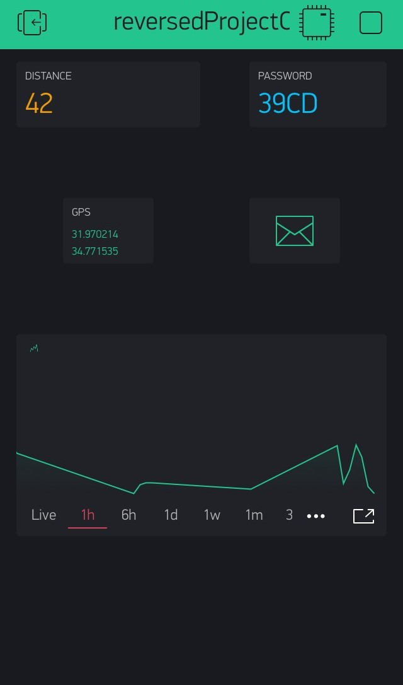
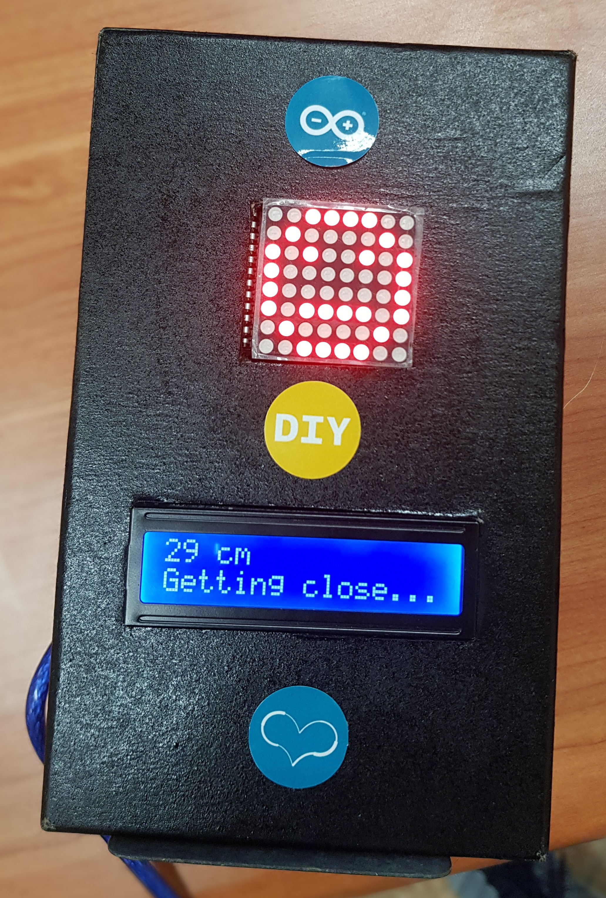
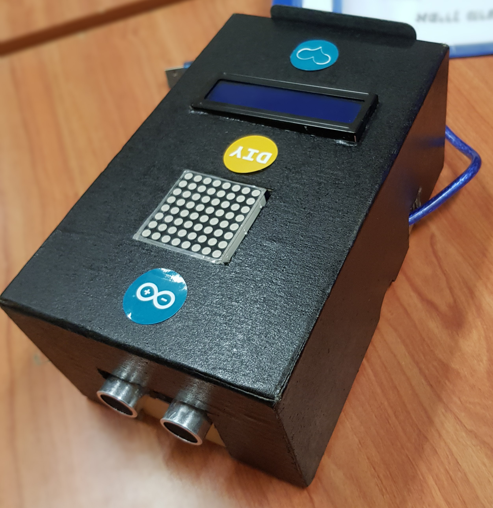
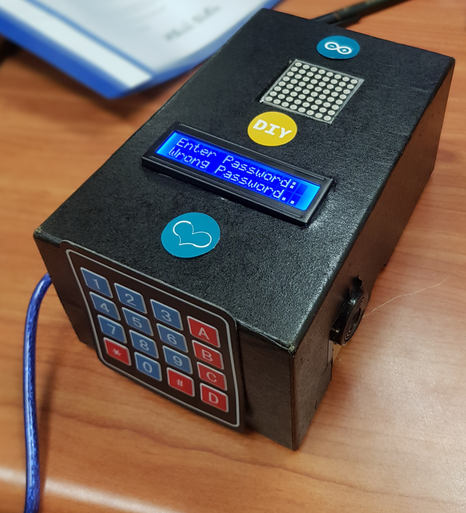

# Smart Reverse #
Smart Reverse POC which can be easily used in any vehicle.

## Features ##
* Generate a newly random password, which is accessible using the Blynk app.
* Measure live distance from other vehicles on real-time and notify the customer
  * LCD screen indicative message
  * Buzzer beeps corresponding to the distance
  * LED matrix with corresponding smiley
* Using Blynk cloud service to show useful information
    * Current password
    * Current distance to crash
    * Email for notifications
    * GPS coordinates
    * Distance history graph for further analysis
* Upon crash, email with GPS location will be sent to the customer

## Examples ##

### Blynk mail dashboard ###

### Getting close ###

### Smart Reverse Back ###

### Wrong Password ###

## Hardware Requirements ##
* Arduino UNO
* Ultrasonic sensor
* LCD 16x2
* Keypad 4x4
* Buzzer
* Led matrix 8x8
* Jumper wires 
* USB Arduino cable
